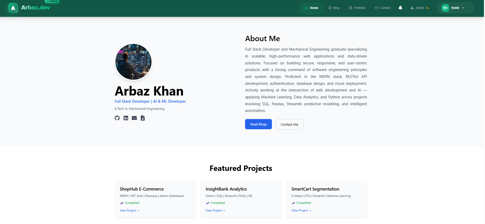
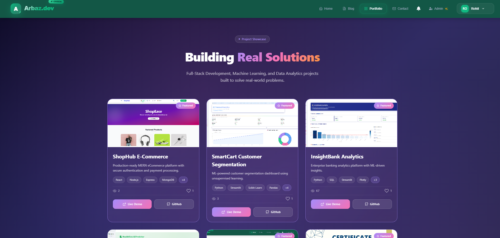
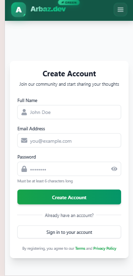
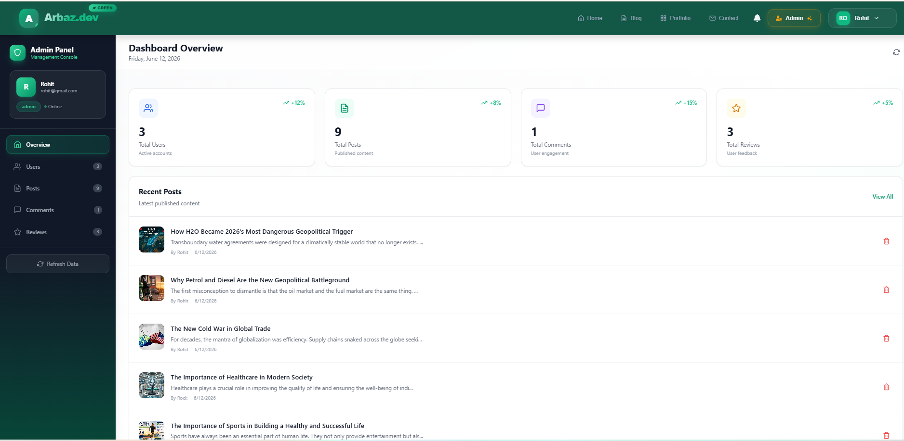

# Full Stack Portfolio & Blogging Platform

A modern full-stack web application that combines a professional portfolio website with a feature-rich blogging platform. The application includes secure authentication, role-based authorization, content management, image uploads, user engagement features, and a responsive user interface.

## Live Demo

Frontend: Coming Soon

Backend API:
https://my-fullstack-app-backend-he88.onrender.com

---

## Features

### Portfolio Features

* Responsive portfolio website
* Project showcase section
* Contact page
* Resume integration
* Mobile-friendly design

### Blogging Platform

* User registration and login
* JWT authentication with secure cookies
* Role-based access control
* Create, edit, and delete blog posts
* Categories and tags
* Comment system
* Review and rating system
* User dashboard
* Admin dashboard
* Notifications

### Media Management

* Cloudinary image uploads
* Profile photo management
* Blog cover image uploads

---

## Tech Stack

### Frontend

* React.js
* React Router DOM
* Axios
* Tailwind CSS
* Framer Motion
* React Icons
* EmailJS

### Backend

* Node.js
* Express.js
* MongoDB Atlas
* Mongoose
* JWT Authentication
* Cloudinary
* Multer

### Deployment

* GitHub
* Render
* MongoDB Atlas

---

## Screenshots

### Home Page



### Projects Page



### Blog Section


### Registration Page



### Admin Dashboard



---

## Installation

### Clone Repository

```bash
git clone <repository-url>
cd frontend
```

### Install Dependencies

```bash
npm install
```

### Environment Variables

Create a .env file in the root directory:

```env
REACT_APP_API_URL=https://my-fullstack-app-backend-he88.onrender.com/api
```

### Run Development Server

```bash
npm start
```

### Build for Production

```bash
npm run build
```

---

## Project Structure

```text
src/
├── api/
├── components/
├── context/
├── pages/
├── routes/
├── App.js
└── index.js
```

---

## Future Improvements

* Rich text editor
* Search and filtering
* Dark mode
* Real-time notifications
* Social authentication
* Analytics dashboard

---

## Author

Arbaz Khan

Mechanical Engineering Graduate
Full Stack Developer
AI & Machine Learning Enthusiast

GitHub: ArbazCod
